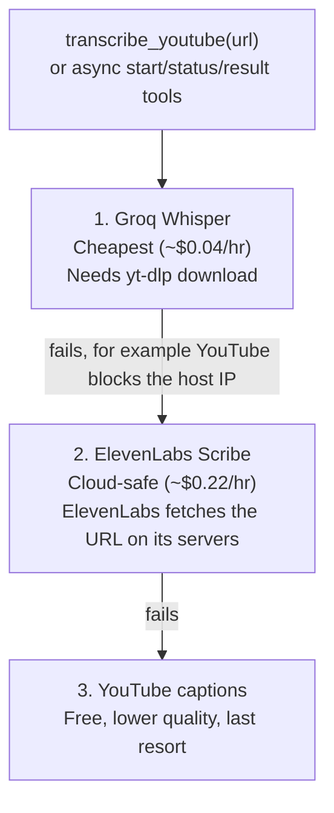

<div align="center">

# YouTube Transcription MCP

**Turn any YouTube link into clean text — straight from your AI assistant.**

An [MCP](https://modelcontextprotocol.io) server that transcribes YouTube videos through a
smart 3-level fallback chain: **Groq → ElevenLabs → YouTube captions**. Drop it into
OpenClaw, Claude Code, Claude Desktop, Cursor, or any MCP client and ask for a transcript
from any chat.

[](https://github.com/OctavioCriollo/youtube-transcription-mcp/actions/workflows/publish.yml)
[](https://modelcontextprotocol.io)
[](https://www.python.org/downloads/)
[](docs/deploy.md)
[](docs/decisions.md)

</div>

---

## Why this exists

You send a YouTube link to your assistant on Telegram (or any channel) and ask:
*"transcribe this for me."* This MCP makes that work — reliably, cheaply, and from
the cloud.

The hard part of YouTube transcription is not the speech-to-text. It's **getting the
audio** when YouTube actively blocks downloads from cloud server IPs. This server solves
that with a chain that always finds a working path:



The first level that succeeds wins. The response tells the agent **which method was used**
and **why earlier ones failed**, so it can be transparent with the user and never silently
hand back low-quality captions as if they were premium audio transcription.

---

## Features

- **Simple sync path.** `transcribe_youtube(url, language?)` still returns a transcript in one call.
- **Production async path.** `start_youtube_transcription` returns a `run_id`;
  `get_transcription_status`, `get_transcription_result`, and `cancel_transcription`
  provide visibility and control for long videos.
- **Cloud-proof.** The ElevenLabs `source_url` level bypasses YouTube IP blocking entirely.
  Optional `YT_COOKIES_FILE` / `YT_PROXY` can improve the cheaper Groq + yt-dlp path.
- **Reusable artifacts.** Completed runs expose transcript, timestamps, SRT, VTT,
  canonical JSON, audit files, and speaker reports when available.
- **Smart reuse.** Completed runs can be reused from the workspace cache with a TTL,
  chosen by provider **priority** (not recency); the subtitles fallback is always
  recomputed so it never shadows a real STT provider.
- **Cost-aware.** Tries the cheapest provider first; only escalates when needed.
- **Auto language detection.** Detects the spoken language; never translates unless asked.
- **Transparent results.** Every response reports `method`, `provider`,
  `estimated_cost_usd`, and `failed_attempts`.
- **Quality signals.** Audio transcripts come with a structural + linguistic audit
  (token parity, low-confidence detection, suspicious unicode, repeated-word loops).
- **Universal.** Standard MCP — works in OpenClaw, Claude Code, Claude Desktop, Cursor, etc.
- **Observable progress.** `watch_transcription` long-polls the job until the next
  `revision` (a new stage/status) so the agent shows progress in the same turn,
  without depending on push notifications.
- **File delivery.** `create_transcription_bundle` packages a completed run into a
  `.zip` on the shared volume and returns a host-side path the gateway can read and
  send — no streaming large artifacts back through the MCP protocol.
- **Server-side provider policy.** Public tools do **not** accept a `provider_order`;
  the order is fixed by the server (configurable via `MCP_*_PROVIDER_ORDER` env vars)
  and every response reports `provider_order_effective` for auditability.
- **Two transports.** `stdio` (default, for `uvx`-style launch) or `streamable-http`
  (for hosting as a remote service).

---

## Installation

This MCP supports two deployment patterns. Public tools, env vars and response
shape are identical across both — only the way the client reaches the server
changes:

- **Desktop clients** (Codex, Claude Code, Claude Desktop, Cursor) launch it as a
  stdio child process via `uvx`, straight from this GitHub repo.
- **OpenClaw on a VPS** (or any container host) runs the prebuilt GHCR image over
  `streamable-http` in its own Docker Compose stack alongside the gateway.

### Desktop clients (uvx via stdio)

**Prerequisites on the host:**

```bash
# uv / uvx (the Python launcher)
curl -LsSf https://astral.sh/uv/install.sh | sh      # Linux/macOS
# Windows: powershell -c "irm https://astral.sh/uv/install.ps1 | iex"

# ffmpeg (only used by the Groq audio path)
sudo apt install ffmpeg        # Debian/Ubuntu
brew install ffmpeg            # macOS
choco install ffmpeg           # Windows (or download from https://ffmpeg.org)
```

#### Codex (`~/.codex/config.toml`)

```toml
[mcp_servers.youtube-transcription]
command = "uvx"
args = ["--from", "git+https://github.com/OctavioCriollo/youtube-transcription-mcp.git", "youtube-transcription-mcp"]
env_vars = ["GROQ_API_KEY", "ELEVENLABS_API_KEY"]
startup_timeout_sec = 120
tool_timeout_sec = 600
```

Set `GROQ_API_KEY` and `ELEVENLABS_API_KEY` as user environment variables, then
restart Codex (or VS Code if you use the Codex extension). Validate with:

```bash
codex mcp list
codex mcp get youtube-transcription
```

#### Claude Code (`~/.claude.json`)

```json
"transcription-youtube": {
  "type": "stdio",
  "command": "uvx",
  "args": [
    "--from",
    "git+https://github.com/OctavioCriollo/youtube-transcription-mcp.git",
    "youtube-transcription-mcp"
  ],
  "env": {
    "GROQ_API_KEY": "gsk_...",
    "ELEVENLABS_API_KEY": "..."
  }
}
```

Or use the CLI:

```bash
claude mcp add transcription-youtube \
  --env GROQ_API_KEY=gsk_... \
  --env ELEVENLABS_API_KEY=... \
  -- uvx --from git+https://github.com/OctavioCriollo/youtube-transcription-mcp.git youtube-transcription-mcp
```

Validate with `claude mcp list`.

#### Claude Desktop

Edit `%APPDATA%\Claude\claude_desktop_config.json` (Windows) or
`~/Library/Application Support/Claude/claude_desktop_config.json` (macOS):

```json
{
  "mcpServers": {
    "transcription-youtube": {
      "command": "uvx",
      "args": [
        "--from",
        "git+https://github.com/OctavioCriollo/youtube-transcription-mcp.git",
        "youtube-transcription-mcp"
      ],
      "env": {
        "GROQ_API_KEY": "gsk_...",
        "ELEVENLABS_API_KEY": "..."
      }
    }
  }
}
```

Restart Claude Desktop after editing.

#### Cursor (`~/.cursor/mcp.json` or `.cursor/mcp.json` in the workspace)

Same `mcpServers` block as Claude Desktop above.

### Server deployment (OpenClaw via streamable-http)

For production, the MCP runs as a container from the prebuilt GHCR image
(`ghcr.io/octaviocriollo/youtube-transcription-mcp:latest`) in a **separate**
Docker Compose stack next to OpenClaw. The two stacks share a private Docker
network (`openclaw-mcp-network`) and a read-write volume
(`openclaw_mcp_workspace`) that the OpenClaw stack owns; this stack joins them
as `external`.

Minimal compose service (full stack, env file template and operator-grade
procedure in [`docs/deploy.md`](docs/deploy.md)):

```yaml
services:
  transcription-mcp:
    image: ghcr.io/octaviocriollo/youtube-transcription-mcp:latest
    pull_policy: always
    restart: unless-stopped
    environment:
      MCP_TRANSPORT: streamable-http
      MCP_HOST: 0.0.0.0
      MCP_PORT: 8000
      MCP_HTTP_PATH: /mcp
      WORKSPACE_DIR: /mcp-workspace/transcription-mcp
      OPENCLAW_WORKSPACE_DIR: /home/node/.openclaw/mcp-workspace/transcription-mcp
      TRANSCRIPTION_JOB_STALE_SECONDS: 180
      TRANSCRIPTION_JOB_TIMEOUT_SECONDS: 3600
      GROQ_API_KEY: ${GROQ_API_KEY}
      ELEVENLABS_API_KEY: ${ELEVENLABS_API_KEY}
    volumes:
      - openclaw_mcp_workspace:/mcp-workspace
    expose:
      - "8000"
    networks:
      - openclaw-mcp-network

volumes:
  openclaw_mcp_workspace:
    external: true

networks:
  openclaw-mcp-network:
    external: true
```

Bring up the OpenClaw stack **first** (it creates the network and volume), then
this MCP stack, then register the MCP **once** (the gateway hot-applies it):

```bash
docker exec openclaw-openclaw-gateway-1 \
  openclaw mcp set youtube-transcription \
  '{"url":"http://transcription-mcp:8000/mcp","transport":"streamable-http"}'

docker exec openclaw-openclaw-gateway-1 openclaw mcp list
```

> **Why not uvx for OpenClaw?** OpenClaw's gateway image does not ship
> `ffmpeg`/`yt-dlp`. Installing them at runtime is lost on container recreate,
> and the uvx model also stored provider API keys inside `openclaw.json`. The
> containerized model ships dependencies inside a self-contained image and
> keeps keys in the MCP stack's `.env`.

#### Variant: host on a separate machine over Tailscale

When the Groq path needs a residential IP (cloud VPS gets HTTP 403 from
YouTube), run the MCP on your home PC instead and point OpenClaw at it over
Tailscale:

```bash
# On the home PC
MCP_TRANSPORT=streamable-http \
GROQ_API_KEY=gsk_... ELEVENLABS_API_KEY=... \
  uvx --from git+https://github.com/OctavioCriollo/youtube-transcription-mcp.git youtube-transcription-mcp
```

```bash
# On the OpenClaw host
docker exec openclaw-openclaw-gateway-1 \
  openclaw mcp set youtube-transcription \
  '{"url":"http://<tailscale-hostname>:8000/mcp","transport":"streamable-http"}'
```

---

## Usage

From any connected chat (Telegram, Discord, WebChat, or the Claude Code prompt):

> **Transcribe this video from my channel:** <YOUR_YOUTUBE_VIDEO_URL>

The agent calls `transcribe_youtube` and replies with the text. Behind the scenes:

```text
[level 1] groq + yt-dlp ........ ✓  → method=groq, cost≈$0.0002
```

or, on a cloud host where YouTube blocks the download:

```text
[level 1] groq + yt-dlp ........ ✗  (HTTP 403 from YouTube)
[level 2] elevenlabs source_url  ✓  → method=elevenlabs, cost≈$0.0012
```

### Tool reference

Synchronous tools:

| Tool                   | Purpose                                                       |
| ---------------------- | ------------------------------------------------------------- |
| `transcribe_youtube`   | Blocking YouTube transcription with Groq -> ElevenLabs -> captions. |
| `transcribe_media_url` | Blocking public media URL transcription via audio providers.  |
| `transcribe_file`      | Blocking local file transcription on the MCP host.            |

Asynchronous production flow:

| Tool                            | Purpose                                                                |
| ------------------------------- | ---------------------------------------------------------------------- |
| `start_youtube_transcription`   | Starts a background job and returns `run_id` immediately.              |
| `start_media_url_transcription` | Starts a background job for a public media URL.                        |
| `start_file_transcription`      | Starts a background job for a local file visible to the MCP host.      |
| `get_transcription_status`      | Instant snapshot of status, stage, progress, `revision`, logs.         |
| `watch_transcription`           | **Long-poll**: blocks until `revision` changes (new stage/status) or timeout, so the agent follows progress in a loop without yielding. |
| `get_transcription_result`      | Returns the final transcript once `status == "completed"`.             |
| `get_transcription_artifact`    | Returns a named text artifact such as `subtitles_srt` or `audit_txt`.  |
| `cancel_transcription`          | Best-effort cancellation of the worker process and its children.        |

Use the async flow for long videos, production agents, or any client where a
silent long-running MCP call would look blocked.

Delivery (for hosts that send files back to the user, e.g. OpenClaw):

| Tool                          | Purpose                                                                |
| ----------------------------- | ---------------------------------------------------------------------- |
| `create_transcription_bundle` | Packages all artifacts of a completed `run_id` into a single `.zip` and returns both the MCP-side path and the host-side path (`bundle_path_for_openclaw`) so the host can read and send it. See [Production hardening](#production-hardening-health-stale-jobs-bundle-delivery). |

### Agent workflow guidance

Async job responses include a small guidance contract for LLM clients:

| Field                       | Purpose                                                       |
| --------------------------- | ------------------------------------------------------------- |
| `user_visible_message`      | Short status text the agent can show directly to the user.    |
| `recommended_next_tool`     | Next MCP tool to call, or `null` when no call is required.    |
| `recommended_poll_seconds`  | Suggested delay before polling again for long-running jobs.   |
| `agent_instructions`        | Operational instructions for the LLM using the MCP response.  |
| `progress_percent`          | Rounded 0-100 progress when the MCP can estimate it.          |
| `available_next_actions`    | Useful actions after a result, such as showing the transcript.|
| `recommended_artifacts`     | Artifact names that can be fetched with `get_transcription_artifact`. |

The server also exposes the prompt `transcribe_with_progress`. MCP clients that
support prompts can use it as a built-in workflow for long transcriptions:

1. call a `start_*_transcription` tool and keep `run_id` + `revision`;
2. show `user_visible_message`;
3. loop `watch_transcription(run_id, since_revision, timeout_seconds)` — it blocks
   until the job changes or times out; show each change to the user. Do **not**
   yield the turn right after `start_*`. (`get_transcription_status` remains as an
   instant-snapshot fallback.)
4. call `get_transcription_result` when `terminal` is true and status is completed;
5. fetch artifacts only when the user asks for subtitles, timestamps, audit
   data, or another listed artifact.

> Why long-poll instead of push: MCP `notifications/progress` only works inside a
> live request with a `progressToken`; it can't wake an agent that already yielded,
> and generic push isn't guaranteed across MCP clients. A durable `revision` + a
> short long-poll (`watch_transcription`) is portable and keeps the agent showing
> progress in the same turn.

This guidance is client-readable metadata. It improves behavior for LLM agents,
but the MCP cannot force a client UI to display progress if that client ignores
the returned fields or prompt.

Common optional parameters:

| Parameter        | Type           | Description                                                        |
| ---------------- | -------------- | ------------------------------------------------------------------ |
| `language`       | string \| null | ISO 639-1 code (`es`, `en`, `pt`...). Omit for auto-detect.        |
| `diarize`        | bool           | Speaker diarization. Currently supported by ElevenLabs only.       |
| `num_speakers`   | int \| null    | Optional expected speaker count for diarization.                   |

> **Provider order is server policy, not a tool argument.** The public tools do
> **not** accept `provider_order`; the order is fixed by the server (defaults:
> YouTube `groq,elevenlabs,subtitles`; media/file `groq,elevenlabs`) and can be
> overridden per source type via `MCP_*_PROVIDER_ORDER` env vars. Every response
> reports the order actually used in `provider_order_effective`.

### Response shape

```jsonc
{
  "transcript": "Alright, so here we are, one of the elephants...",
  "language": "english",
  "duration_s": 19.021,
  "model": "whisper-large-v3-turbo",
  "provider": "groq",
  "method": "groq",                       // groq | elevenlabs | subtitles
  "provider_order_effective": ["groq", "elevenlabs", "subtitles"], // server policy, not a client arg
  "cache": { "hit": false },
  "estimated_cost_usd": 0.0002,
  "source": { "type": "youtube", "url": "<YOUR_YOUTUBE_VIDEO_URL>", "path": null },
  "youtube": { "video_id": "<YOUR_VIDEO_ID>", "title": "Example video", "channel": "Your channel" },
  "artifacts": {
    "transcript_txt": { "path": ".../transcript.txt", "exists": true, "size_bytes": 1234 },
    "subtitles_srt": { "path": ".../subtitles.srt", "exists": true, "size_bytes": 2345 },
    "subtitles_vtt": { "path": ".../subtitles.vtt", "exists": true, "size_bytes": 2345 }
  },
  "quality_status": "pass",
  "audit": { "status": "pass", "verdict": "artifacts passed structural and quality checks" },
  "failed_attempts": {                     // present only if an earlier level failed
    "groq": "GroqProviderError[auth]: ..."
  }
}
```

---

## Configuration

All configuration is via environment variables. Each provider level is optional —
a missing key simply skips that level.

| Variable             | Default                          | Purpose                                                      |
| -------------------- | -------------------------------- | ----------------------------------------------------------- |
| `GROQ_API_KEY`       | —                                | **Level 1.** Groq Whisper. Free tier at console.groq.com.   |
| `ELEVENLABS_API_KEY` | —                                | **Level 2.** ElevenLabs Scribe v2 (cloud-safe fallback).    |
| `MCP_TRANSPORT`      | `stdio`                          | `stdio` for `uvx`-launched, or `streamable-http` for remote. |
| `WORKSPACE_DIR`      | OS user data dir                 | Cache for downloads + transcript artifacts.                 |
| `MCP_HOST`           | `0.0.0.0`                        | HTTP mode only.                                             |
| `MCP_PORT`           | `8000`                           | HTTP mode only.                                             |
| `MCP_HTTP_PATH`      | `/mcp`                           | HTTP mode only.                                             |
| `YT_COOKIES_FILE`    | —                                | Optional cookies.txt path for the Groq/yt-dlp download path. |
| `YT_PROXY`           | —                                | Optional yt-dlp proxy for the Groq/local download path.     |
| `MCP_CACHE_TTL_HOURS`| `24`                             | Completed-run reuse window. Set `0` to disable cache hits.  |
| `MCP_MAX_CONCURRENT_JOBS` | `2`                        | Maximum active async worker jobs.                           |
| `MCP_JOB_TTL_HOURS`  | `168`                            | Cleanup window for completed/failed/canceled MCP job records. |
| `TRANSCRIPTION_JOB_STALE_SECONDS` | `180`               | Seconds without a heartbeat before a running job is marked `stale_failed` (frees the concurrency slot). `0` disables. |
| `TRANSCRIPTION_JOB_TIMEOUT_SECONDS` | `3600`            | Hard ceiling in seconds for a single job. `0` disables.     |
| `OPENCLAW_WORKSPACE_DIR` | —                            | How the host (OpenClaw gateway) sees this MCP's workspace via its read-only mount. Used only to report `bundle_path_for_openclaw`; the MCP never reads/writes this path. |
| `MCP_YOUTUBE_PROVIDER_ORDER` | `groq,elevenlabs,subtitles` | Server-owned provider order for YouTube. Clients cannot override it. |
| `MCP_MEDIA_PROVIDER_ORDER` | `groq,elevenlabs`            | Server-owned provider order for media URLs.                 |
| `MCP_FILE_PROVIDER_ORDER` | `groq,elevenlabs`             | Server-owned provider order for local files.                |
| `MCP_LOCK_PROVIDER_ORDER` | `true`                        | Ignore any client-supplied provider override (e.g. from a debug tool) in favor of the server order. |

> With **no** API keys set, only the free YouTube-captions level is available.

`WORKSPACE_DIR` is optional but recommended for Docker or hosted deployments.
When it is omitted, the MCP uses an OS-standard per-user data directory:

- Windows: `%LOCALAPPDATA%\transcription-mcp\workspace`
- macOS: `~/Library/Application Support/transcription-mcp/workspace`
- Linux: `$XDG_STATE_HOME/transcription-mcp/workspace`, or
  `~/.local/state/transcription-mcp/workspace` when `XDG_STATE_HOME` is unset

Docker images in this repo set `WORKSPACE_DIR=/workspace` as the standalone
default. The MCP no longer probes `/workspace` implicitly, because on Windows that
can resolve to a drive-root directory outside the user's normal application data
area.

**Production (OpenClaw) override.** In the OpenClaw deployment the workspace lives
on a shared volume so the host can read artifacts. There, `WORKSPACE_DIR` is set to
`/mcp-workspace/transcription-mcp` (a per-MCP subdirectory of the shared
`openclaw_mcp_workspace` volume), and `OPENCLAW_WORKSPACE_DIR` tells the MCP how the
gateway sees that same volume (read-only) so it can report `bundle_path_for_openclaw`.
The image intentionally declares **no** `VOLUME` directive: persistence is the
deployer's job via the mounted volume. (A bare `VOLUME ["/workspace"]` would make
Docker spawn a throwaway anonymous volume on every container recreate.)

`YT_COOKIES_FILE` and `YT_PROXY` are optional. If neither is set, behavior is
unchanged. If `YT_COOKIES_FILE` is set but the file does not exist, startup fails
fast because that is a host misconfiguration.

---

## Production hardening (health, stale jobs, bundle delivery)

These features address two real production problems: an MCP that was *alive but
useless* after a failed/hung job, and a host that could not deliver MCP-generated
files.

**`/health` endpoint (HTTP transport).** The server exposes `GET /health` returning
`{"status":"ok","transport":...,"workspace_dir":...,"active_jobs":N}` (200) or 503.
The Docker `HEALTHCHECK` hits this route instead of merely checking the TCP port, so
a hung-but-listening MCP is reported `unhealthy` and the runtime can restart it.

**Heartbeat + stale detection.** A running worker writes `heartbeat_at` every ~2s.
If a non-terminal job goes longer than `TRANSCRIPTION_JOB_STALE_SECONDS` (default
180) without a heartbeat, it is moved to the terminal state `stale_failed` and stops
counting as active, freeing the concurrency slot. `agent_guidance` then recommends
retrying. `TRANSCRIPTION_JOB_TIMEOUT_SECONDS` is a hard per-job ceiling.

**Bundle delivery (`create_transcription_bundle`).** Hosts like OpenClaw run the MCP
in a separate container and need to *read* the artifacts to send them to the user.
The tool packages a completed run's artifacts into
`<run_dir>/exports/transcription_bundle.zip` (atomic write) on the shared volume and
returns:

| Field | Meaning |
| --- | --- |
| `bundle_path_for_mcp` | Path as the MCP sees it (e.g. `/mcp-workspace/transcription-mcp/...`). |
| `bundle_path_for_openclaw` | The **same** file rebased to how the host sees it via its read-only mount (e.g. `/home/node/.openclaw/mcp-workspace/transcription-mcp/...`). The host sends **this**. |
| `sha256`, `size_bytes`, `included_artifacts`, `expires_at` | Integrity + contents + TTL. |

The bundle is **temporary and regenerable** — the source of truth stays in
`storage`; it can be cleaned by TTL without data loss. Path rebasing uses
`WORKSPACE_DIR` (MCP side) and `OPENCLAW_WORKSPACE_DIR` (host side). See
[`docs/deploy.md`](docs/deploy.md) for the full OpenClaw deployment.

---

## Architecture

```text
youtube-transcription-mcp/
├── src/
│   ├── transcription_mcp/            # MCP layer (tools, jobs, pipeline)
│   │   ├── server.py                 # FastMCP setup, stdio/http dispatch
│   │   ├── tools.py                  # sync + async MCP tool registration
│   │   ├── jobs.py                   # persistent async job status/result/cancel + stale detection
│   │   ├── worker.py                 # subprocess worker (writes heartbeat_at) for long transcriptions
│   │   ├── bundle.py                 # package run artifacts into a .zip, rebase host path
│   │   ├── pipeline.py               # 3-level fallback orchestration
│   │   ├── youtube_subtitles.py      # captions via youtube-transcript-api
│   │   └── config.py                 # env-var configuration
│   └── transcription_engine/             # vendored transcription engine
│       ├── providers.py              # Groq + ElevenLabs (+ local) providers
│       ├── pipeline.py               # download, chunk, merge, finalize
│       ├── chunking.py               # split long audio, merge by absolute time
│       ├── subtitles.py              # SRT/VTT builders (lossless)
│       ├── quality.py / audit.py     # structural + linguistic validation
│       └── ...
├── docs/
│   ├── deploy.md                     # step-by-step deployment + troubleshooting
│   └── decisions.md                  # architectural rationale
├── tests/                            # provider policy, cache priority, jobs, watch, subtitles, pipeline, smoke
├── Dockerfile
└── uv.lock                           # reproducible dependency resolution for CI/Docker
```

The MCP layer is deliberately thin: it imports the vendored `transcription_engine` package
directly (no subprocess), orchestrates the fallback chain, and returns a clean JSON object.
See [`docs/decisions.md`](docs/decisions.md) for the full rationale.

---

## Development

```bash
git clone https://github.com/OctavioCriollo/youtube-transcription-mcp.git
cd youtube-transcription-mcp

uv sync --frozen --extra dev

uv run --frozen pytest
uv run --frozen ruff check .
uv pip check
```

Run locally over stdio (what `uvx` does):

```bash
GROQ_API_KEY=gsk_... ELEVENLABS_API_KEY=... uv run --frozen youtube-transcription-mcp
```

Quick HTTP smoke test:

```bash
MCP_TRANSPORT=streamable-http uv run --frozen youtube-transcription-mcp &
curl -s -X POST http://localhost:8000/mcp \
  -H "Content-Type: application/json" \
  -H "Accept: application/json, text/event-stream" \
  -d '{"jsonrpc":"2.0","id":1,"method":"tools/list","params":{}}'
```

---

## License

MIT — see [LICENSE](LICENSE).

---

<div align="center">
<sub>Built on the <a href="https://modelcontextprotocol.io">Model Context Protocol</a> ·
Powered by <a href="https://groq.com">Groq</a> &amp; <a href="https://elevenlabs.io">ElevenLabs</a></sub>
</div>
